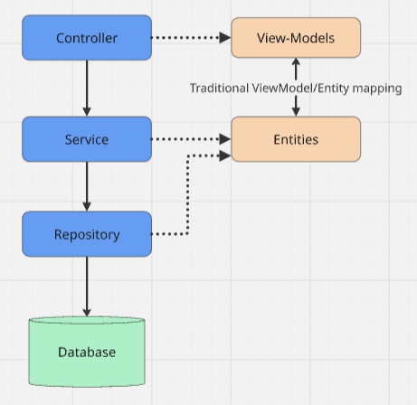

# 2degrees Applications Developer Coding Test.

## Introduction

This repository contains a simple ASP.NET Core REST API which can be used to create and get accounts.
It might be used by a website or mobile app to allow staff to create new accounts, or customers to view their account details.

The object of this test is to modify this API to meet a new requirement, which is described at the bottom of this page.

## Prerequisites

Before you get started, you will need the following:

* A Git client and a Github account
* .NET Core SDK 9.0
* An IDE such as Visual Studio 2022
* An API client such as HTTPie or Postman

## Getting started

1. Open the solution file using Visual Studio

2. Click `F5` to start the API. If you're prompted to install the SSL certificate then do so. 

3. This should open a browser window displaying a list of organisational units.

4. Try using HTTPPie or Postman to get that same list of organisational units.

  ```
  $ http localhost:54142/organisationalunits

HTTP/1.1 200 OK
Content-Type: application/json; charset=utf-8
Date: Mon, 14 Sep 2020 20:34:14 GMT
Server: Kestrel
Transfer-Encoding: chunked

[
    "Orcon",
    "Slingshot",
    "Flip"
]
  ```

5. Now let's create an account.

```
$ echo '{
     "name":"Bob Limited",
     "organisationalUnit": "Orcon",
     "contacts": [{
         "firstName": "Bob",
         "lastName": "Jones",
         "phoneNumber": "091234567",
         "mobileNumber": "0201234567",
         "emailAddress": "bob.jones@boblimited.com",
         "role": "Billing"
     }]
 }' | http POST localhost:54142/accounts

HTTP/1.1 200 OK
Content-Type: application/json; charset=utf-8
Date: Mon, 14 Sep 2020 21:02:03 GMT
Server: Kestrel
Transfer-Encoding: chunked

{
    "accountId": 1
}
```

6. Finally, let's get the account we just created.

```
$ http localhost:54142/accounts/1

HTTP/1.1 200 OK
Content-Type: application/json; charset=utf-8
Date: Mon, 14 Sep 2020 21:06:28 GMT
Server: Kestrel
Transfer-Encoding: chunked

{
    "accountId": 1,
    "contacts": [
        {
            "contactId": 1,
            "emailAddress": "bob.jones@boblimited.com",
            "firstName": "Bob",
            "lastName": "Jones",
            "mobileNumber": "0201234567",
            "phoneNumber": "091234567",
            "role": "Billing"
        }
    ],
    "name": "Bob Limited",
    "organisationalUnit": "Orcon"
}
```

## API Design

The diagram below provides an overview of an API design that is typical at 2degrees. However, the API being used for this test does not have a distinct repository layer, with service layer instead interacting directly with EF Core.



## Existing Domain

Some characteristics of the existing domain model are:
* The central entity is the account.
* An account must belong to an organisational unit.
* An account must have exactly one billing contact, but may have additional contacts

## New Requirement - Change invoice delivery method

### Description

As a account holder, I want to be able to choose how I receive my invoice. Either by paper, email, or text.

### Acceptance Criteria

* It is possible to change the method by which the account receives their invoice.
* If an account wants to receive their invoice by email, the account must have a valid billing email.
* If an account wants to receive their invoice by text, the account must have a valid billing mobile number.

